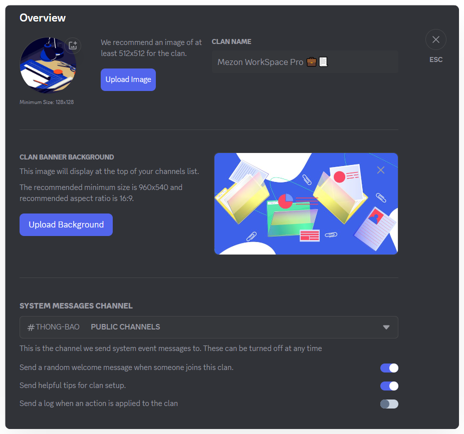

import Tabs from "@theme/Tabs";
import TabItem from "@theme/TabItem";
import overviewMobile001 from './images/overview-mobile-001.png';

# Overview
<Tabs>
<TabItem value="PC" label="PC">

In this section, you can:

* **Change Clan Name**: The Clan name must be unique and not duplicate any existing Clan.
* **Change Avatar**: The avatar should be 512x512 pixels, with a minimum size of 128x128 pixels.
* **Change Banner (Background)**: The banner is displayed directly below the Clan name. Minimum size is 960x540 pixels, with optimal display at a 16:9 ratio.
* **Select Default Channel**: Choose a default channel to receive system messages and customize automatic messages.

:::warning Note
* **Maximum Clan Avatar Size**: 1 MB
* **Maximum Clan Banner (Background) Size**: 10 MB
:::
</TabItem>
<TabItem value="mobile" label="Mobile">

In this section, you can manage the basic information and key settings of your Clan:

* **Change Clan Name:** The name must be unique and cannot duplicate an existing Clan.
* **Change Cover Image:** The cover appears right below the Clan name.

:::warning
Minimum size **960×540 px**, best displayed at **16:9 ratio**, maximum file size **10MB**.
:::

* **Set Default Channel:** Choose a channel to receive system messages or configure automated messages.
* **Notification Settings:** Customize default notification preferences for your Clan members.
* **Delete Clan:** Permanently remove your Clan from the system when no longer needed.
</TabItem>
</Tabs>
