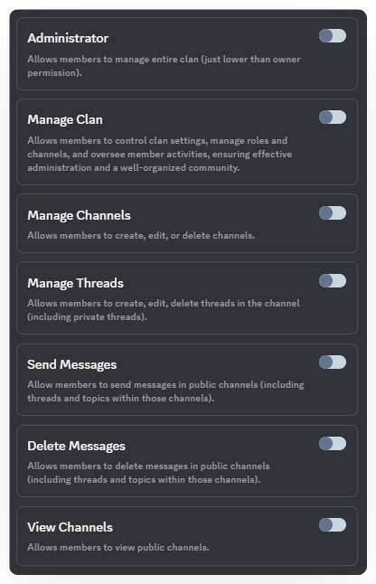
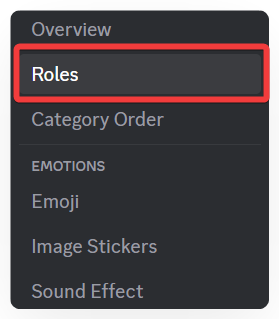
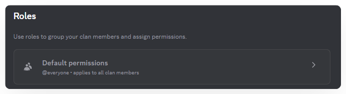
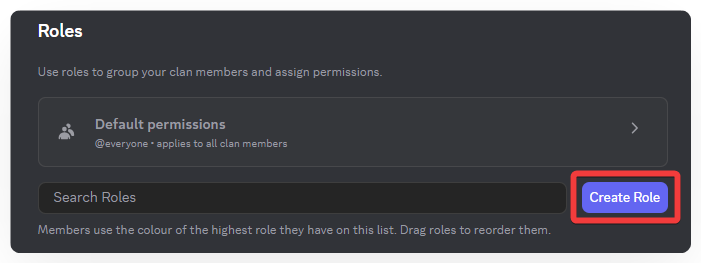
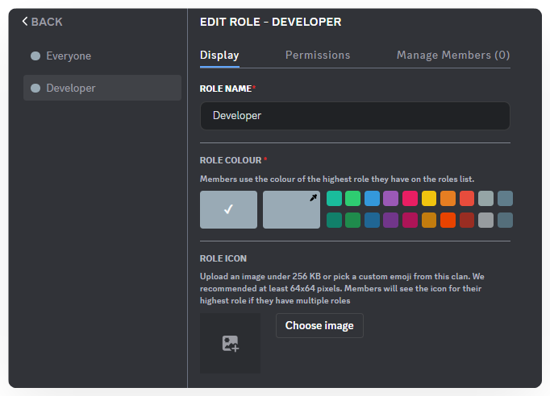
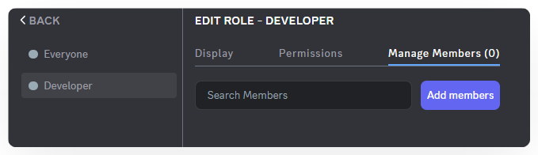
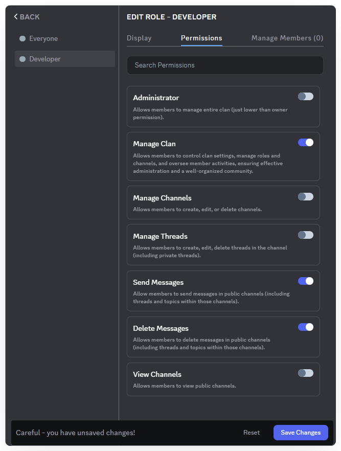
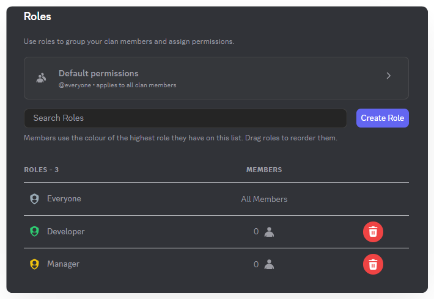
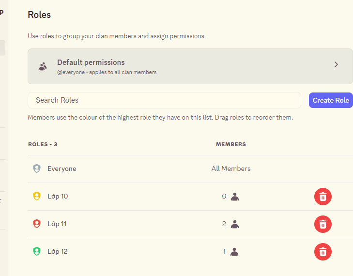
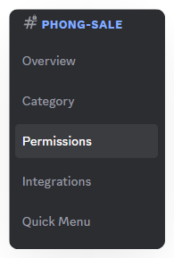

import Tabs from "@theme/Tabs";
import TabItem from "@theme/TabItem";
import rolesAndPermissionsManagementMobile001 from './images/roles-and-permissions-management-mobile-001.png';
import rolesAndPermissionsManagementMobile002 from './images/roles-and-permissions-management-mobile-002.png';
import rolesAndPermissionsManagementMobile003 from './images/roles-and-permissions-management-mobile-003.png';
import rolesAndPermissionsManagementMobile004 from './images/roles-and-permissions-management-mobile-004.png';
import rolesAndPermissionsManagementMobile005 from './images/roles-and-permissions-management-mobile-005.png';
import rolesAndPermissionsManagementMobile006 from './images/roles-and-permissions-management-mobile-006.png';

# Roles & Permissions Management
Managing roles and permissions helps you control what each member can do within the Clan, ensuring the community remains safe and organized.

<Tabs>
<TabItem value="PC" label="PC">
### **1. Permissions Management**

As your community grows, both the number of members and the level of interaction increase. Without proper control over permissions, issues such as message spam, deletion of important content, or unintended channel edits can occur. This not only disrupts order but also negatively affects the overall experience of the group.

#### **Available Permissions in the System**

* **Administrator** – Full control over the Clan and channel list (almost equivalent to the owner).
* **Manage Clan** – Manage Clan settings, roles, channels, and member activities.&#x20;

:::info
However, the **Manage Clan** permission **cannot view or manage the full channel list**, which distinguishes it from **Administrator**.
:::

* **Manage Channel** – Create, edit, and delete channels.
* **Manage Thread** – Create, edit, and delete threads (including private threads).
* **Send Message** – Send messages in public channels (including threads/topics).
* **Delete Message** – Delete messages in public channels (including threads/topics).
* **View Channel** – View public channels.

:::info
**Distinguishing Clan Permissions**

1. **Owner**

* When a Clan is created, the creator is automatically the Owner.
* No one can kick the Owner; the Owner can only transfer ownership to another member.
* Holds the highest authority and can perform all actions.
* Has absolute administrative control, including managing members, roles, channels, and all Clan settings.

2. **Administrator**

* Authority is just below the Owner, with almost full control over the Clan.
* Can manage the channel list, roles, members, and most settings.
* Can kick other Administrators or regular members, but **cannot kick the Owner**.
:::

#### **How to set Permissions**

1. In the left menu, select **Roles**.

2. Under **Default Permissions**, set the basic actions that all members in the Clan can perform.

3. Choose the permissions you want to apply to everyone and click **Save Changes**.

:::info
By default, all new members joining the Clan are assigned the **@everyone** role.\
For this role, it is recommended to enable only the minimum permissions, such as **View Channel** and **Send Message**, to ensure order and safety within the community.
:::

### **2. Roles Management**

Not all members in a Clan need the same permissions. With **Roles**, you can create multiple roles with different permissions. You can also assign colors and icons to each group. This helps the Clan operate more professionally and makes management easier as your community grows.

#### **How to Create and Assign Roles**

1. In the left menu, select **Roles**.
2. Click **Create Role**, then edit the **name, color, and icon** under **Displays**.

:::warning Note
**Maximum Role Icon Size**: 256 KB
:::

3. Under **Manage Members**, click **Add Members** to assign members to the **Role**.

:::tip
You can grant or revoke advanced permissions by creating a new role and assigning it to specific members (done in **Manage Members**).
:::

4. In **Permissions**, customize what actions the role can perform (e.g., Admin, Send Message, Delete Message, etc.).

5. Click **Save Changes** to apply the role settings.
6. **Changing Role Display Order**

Simply drag and drop roles to arrange their display order. If a member has multiple roles, the display will follow this order.

### **3. Override Permissions**

**Override Permissions** allow you to set special permissions for **private channels** or **private threads**.

* When a channel/thread is created as private, only the **roles or users** who are directly added can see it.
* Within each private channel/thread, you can **customize detailed permissions** for each role or user:
  * Allow or deny viewing the channel.
  * Allow or deny sending messages.
  * Allow or deny managing threads, deleting messages, etc.

**How to Customize Permissions in a Private Channel/Thread:**

1. Click the **gear icon** on your private channel/thread.

2. Select **Permissions** from the left menu.

3. Customize the permissions for members in your channel.

4. Click **Save Changes** to apply.

:::tip
This feature allows flexible management. For example, a regular member may only read content in a private channel, while a moderator can both read and send messages.
:::
</TabItem>
<TabItem value="mobile" label="Mobile">
### 1. Permissions Management

As the community grows, the number of members and interactions increases. Without proper control, issues such as spam, accidental deletion of important content, or unwanted channel edits may occur, affecting the overall experience.

#### **1.1. Available Permissions**

<figure></figure>

* **Administrator** – Full control over the Clan (just below the owner).
* **Manage Clan** – Allows members to control clan settings, roles, and channels, monitor member activity, and ensure organized management.&#x20;

:::danger
However, **Manage Clan** permission 
**cannot see/manage all channels like Administrator.**

:::

* **Manage Channel** – Create, edit, or delete channels.
* **Manage Thread** – Create, edit, or delete threads within channels, including private threads.
* **Send Message** – Send messages in public channels (including threads and short discussions).
* **Delete Message** – Delete messages in public channels (including threads and short discussions).
* **View Channel** – View public channels.

:::info
&#x20;**Clan Hierarchy**

* **Owner** – Highest authority; **can perform all actions**. Cannot be removed. Can transfer ownership to others. Has absolute control over members, roles, channels, and settings.
* **Administrator** – Just below the owner, **almost full control of the Clan**. Can manage channels, roles, members, and most settings. Can remove other admins or regular members, but cannot remove the owner.
:::

#### **1.2. Setting Default Permissions**

1. Go to **Clan Settings → Roles**.
2. Select **@everyone** to set default permissions for all members.

3. Enable or disable basic actions members are allowed to perform.\
   

:::warning
_Recommended:_ Only enable **View Channel** and **Send Message** to maintain order and safety.
:::

4. Click **Save Changes** to apply permissions to all members.

### 2. Roles Management

Not all members need the same permissions. Roles let you create multiple groups with custom colors, icons, and detailed permissions. This helps the Clan operate professionally and scale as the community grows.

#### **2.1. Creating a New Role**

1. Go to **Clan Settings → Roles**.
2. Click the **“+”** icon to create a new role.

3. Set a name, permissions, and assign members.
4. Click **Save** to finish.

#### **2.2. Managing Existing Roles**

*   Tap a role to:

    * **Edit Display**: Change name, color, icon.
    * **Edit Permissions**: Enable/disable actions like sending messages, deleting messages, managing channels.
    * **Manage Members**: Add or remove members from the role.
    * **Delete Role**: Remove roles that are no longer needed.

    

### 3. Permission Overrides

Permission overrides allow you to set special permissions for **private channels or threads.** Only members with the assigned role or explicitly added users can see them.

#### **Customizing Permissions in Private Channels/Threads**

1. Press and hold the private channel/thread you want to edit.
2. Select **Edit Channel**.
3. Go to **Channel Permissions**.
4. Two sections appear:
   * **Basic:** Add roles or members to the private channel/thread.
   *   **Advanced:** List all members in the channel/thread. Customize permissions for each member individually:

       * Allow or block viewing the channel.
       * Allow or block sending messages.
       * Allow or block managing threads, deleting messages, etc.

       

5. Click **Save Changes** to apply.

:::tip
This feature allows flexible management—for example, a regular member can only read content in a private channel, while an assistant admin can read and send messages.
:::
</TabItem>
</Tabs>
