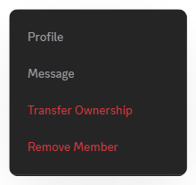
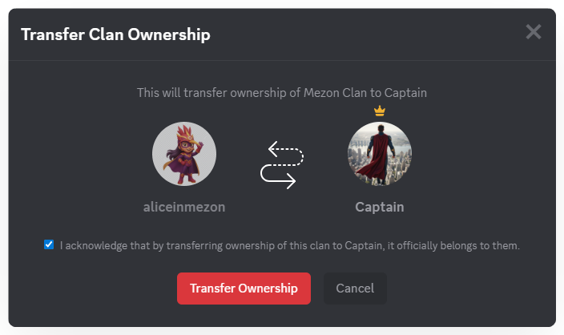

# Transferring Clan Ownership
When you need to change the administrator or hand over the community, you can transfer Clan ownership to ensure continuous management and smooth operation.

### **Steps to Transfer Ownership:**

1. In the left menu, select **Members**.

2. Right-click on the member you want to transfer ownership to, then select **Transfer Ownership**.

3. Check the confirmation box, then click **Transfer Ownership** to complete the process.

