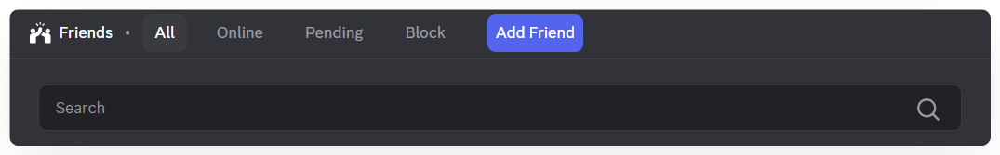

# Add friends
Friends page is where you manage all your personal connections on Mezon.

The **Friends** page is where you manage all your personal connections on Mezon.\
Here, you can **search for people, add new friends, organize your friend list**, or **see who’s online** to start a chat instantly.

Mezon is designed to bring you a **natural and seamless communication experience** — whether in private conversations or within your communities.

You can:

* **Add friends** using their Mezon username or display name.
* **Send messages**, make **voice or video calls**, or **share your screen** — all without leaving the app.
* **See your friends’ online status** in real time.
* **Block or remove connections** to keep your contact list clean and organized.

### **1. Add Friend – Connect with New People**

* Enter a **Mezon Username** to add a new friend.
* This section also lets you filter and manage your friend list:
  * **All:** Show all friends.
  * **Online:** Show only friends who are currently online.
  * **Pending:** View your friend requests.
  * **Block:** See the list of users you’ve blocked.

### **2. Message History**

* Displays all your previous conversations, including chats with bots.
* Simply click on any conversation to continue chatting instantly.

### **3. Friends List**

* Your friends are displayed based on their current status.
* See who’s online and send messages faster.

### **4. Activity**

* Shows what your friends are currently doing on Mezon.
* There are three types of activities automatically updated by Mezon:
  * **Coding:** The user is using a code editor.
  * **Music:** The user is listening to music apps like Spotify or Apple Music.
  * **Gaming:** The user is playing a game.